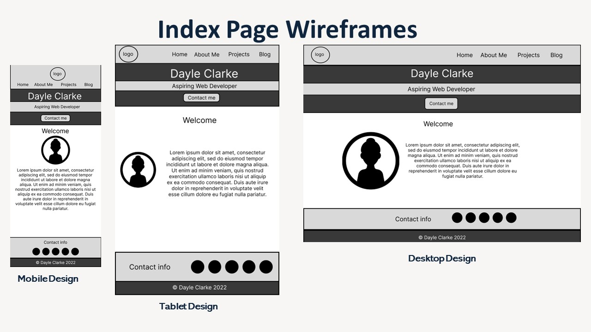
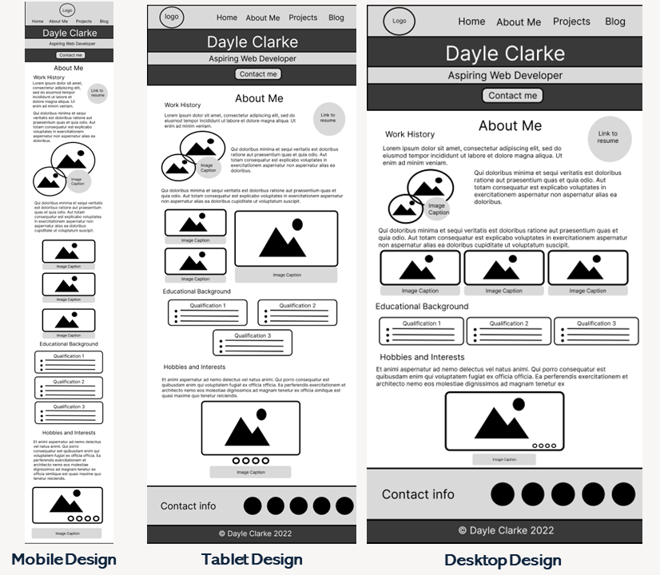
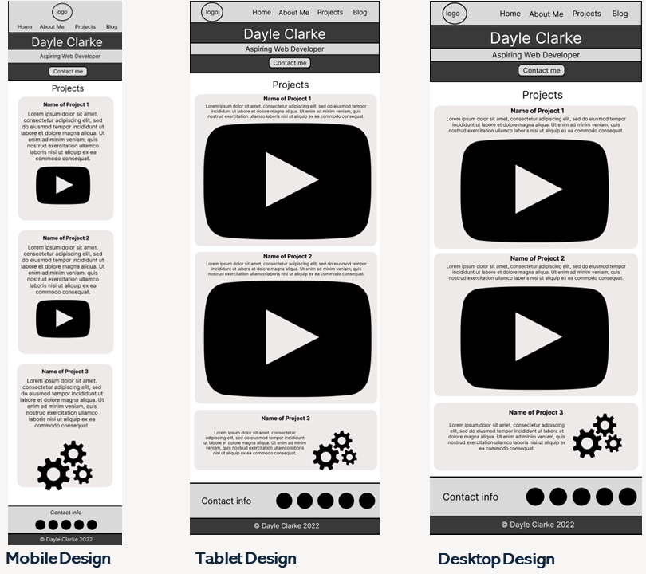
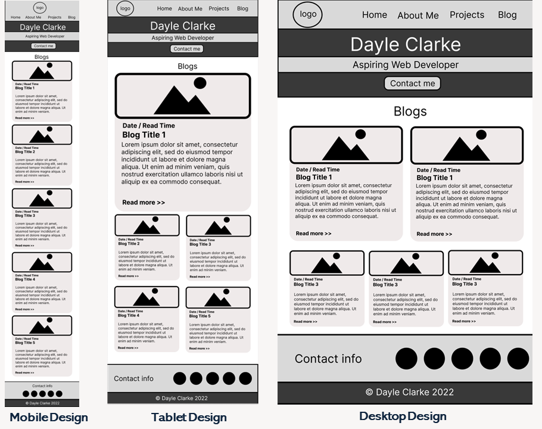
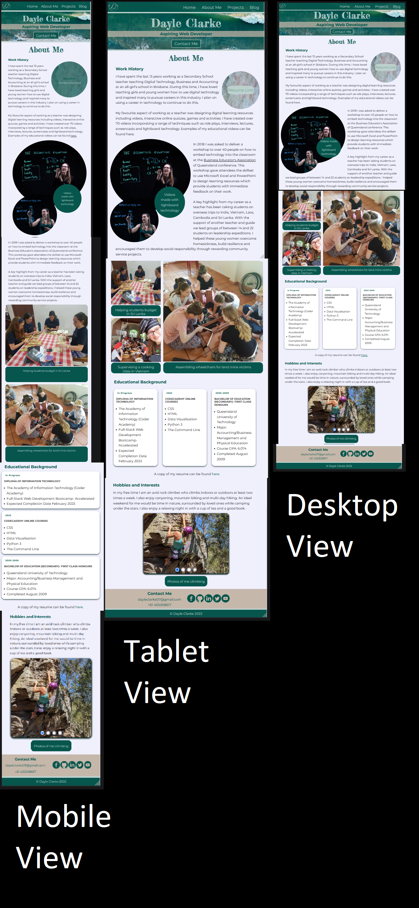
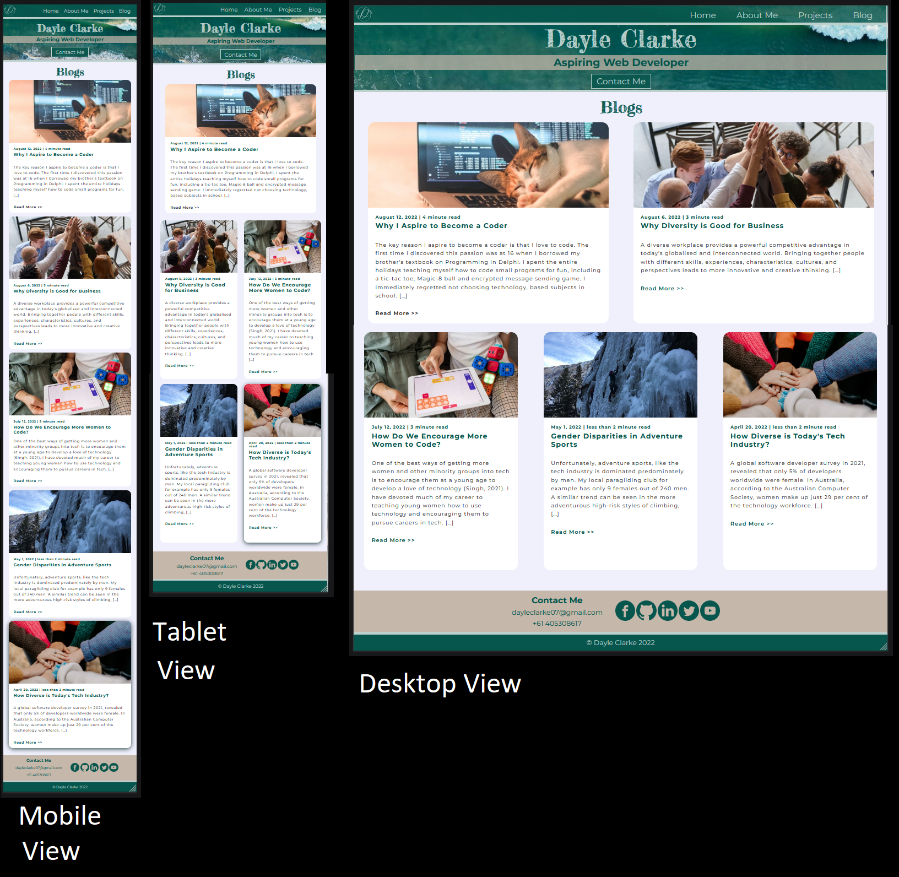
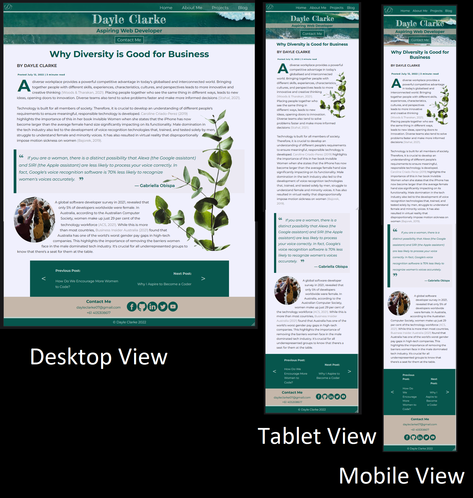

# Portfolio Documentation
---

## [Portfolio Website](https://dayle-clarke.netlify.app)
## [Github Repo](https://github.com/dayleclarke/portilio-website)

---
## Purpose 

The purpose of this website is to:

* showcase my talent, abilities and coding experience to perspective employers in the web development and IT industry.
* make a strong and lasting first impression.
* demonstrate my professionalism and strong work ethic
* be memorable and stand out from the crowd of other developers.
* provide information about myself as an individual to humanise me and demonstrate my unique personality and character. I want my sense of adventure, love of problem solving and natural curiosity/love of learning to show through.

## Target Audience

The target audience for this website are employers looking to engage a junior developer and/or an IT professional. They are likely to have technical knowledge relating to information technology, software development/coding, programming languages and development stacks.  They would be seeking to engage with candidates with an excellent work ethic who demonstrate competence and professionalism.  

- - -

## Sitemap

Created using FigJam and exported using Figma

---

## WireFrames

The following wireframes were created in the design process of this website.

### Index Page Wireframes

### About Me Wireframes

### Projects Wireframes

### Blog Wireframes

### Blog Post Wireframe

Note: The same basic design for the blog page will be used for mobile, tablet and desktop devices.

## Screenshots

### Index Page Screenshots

### About Me Screenshots

### Project Screenshots

### Blog Screenshots

### Blog Post Screenshots

