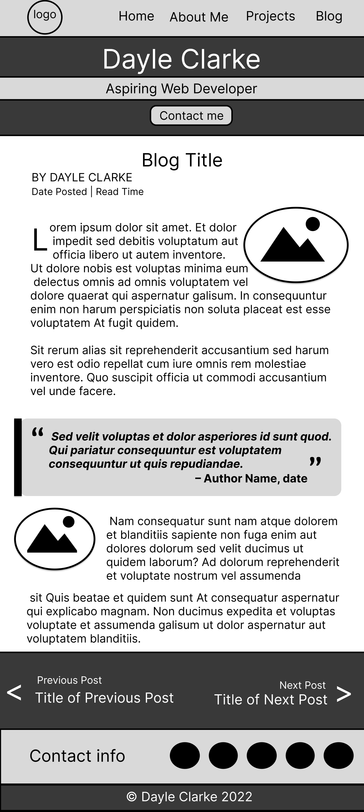

# Portfolio Documentation
---

## [Portfolio Website](https://dayle-clarke.netlify.app)
## [Github Repo](https://github.com/dayleclarke/portilio-website)

---
## Purpose 

The purpose of this website is to:

* showcase my talent, abilities and coding experience to perspective employers in the web development and IT industry.
* make a strong and lasting first impression.
* demonstrate my professionalism and strong work ethic.
* be memorable and stand out from the crowd of other developers.
* provide information about myself as an individual to humanise me and demonstrate my unique personality and character. I want my sense of adventure, love of problem solving and natural curiosity to show through.

## Target Audience

The target audience for this website are employers looking to engage a junior developer and/or an IT professional. They are likely to have technical knowledge relating to information technology, software development/coding, programming languages and development stacks.  They would be seeking to engage with candidates with an excellent work ethic who demonstrate competence and professionalism.  

- - -
## Functionality and Features

This website is made using HTML and CSS utilising both Flexbox and CSS grid. Each page within the site has the following features:

* Full utilisation of HTML5 semantic elements to add meaning and cater for accessibility.
*  A fully responsive layout that will display all components at desktop, mobile, and tablet viewport widths. This was achieved through:
   * Adopting a mobile first approach with media queries written for screens larger than 400px, 650px and 1000px.  These sizes were chosen based on where break points were in the website content. This was found through testing using the inspect/developer tools in Chrome to ensure content wasn’t distorted, cut out, or obscured on screens sizes 320px to 3000px. I also utilised media queries on *Flexbox* and *Grid* containers to increase the number of columns content was presented in at larger screen sizes to make use of the extra screen width.
   * Relative units of measure (including REM, EM VW and VH) when setting the size of content on the page.
  * Minimum and maximum sizes (and the clamp tool) were utilised to set ideal sizes at different screen widths.
* A fully functioning animated navigation bar at the top to easily navigate to different pages throughout the site. 
* A hero element displaying the website name and a call to action (to contact me which provides an anchor link to my contact details at the bottom of the page).
* A footer with my contact details and links to my social media and other professional accounts.
* Hover animations to indicate links throughout the site to increase functionality.
* The use of variables to set the font family and primary and secondary colours of the site to make it easy to test and change different styling options.
* A consisent colour scheme, font family, margin and padding size and animations for unity and consistency accross the site.

As shown in the site map below the website itself contains the following pages:

1. An “index/homepage” to welcome the viewer and introduce myself as the creator. This page will discuss the purpose of the site and provide an overview of the website’s contents.
2. An “about me” page that will provide an overview of my work history, educational background and hobbies and interests.  This page utilises CSS Flexbox and CSS grid to display many photos.  It also contains a photo slider I created using radio buttons which is ideal for all screen sizes. There is a link to a PDF version of my resume.
3. A “projects” page to showcase my previous work.  This is a work in progress and will be updated as my skillset improves.  Currently it contains two embedded YouTube videos of me explaining previous work that I have created.   It also describes a terminal application which is the next project I will be working on in my studies.
4. A blog page containing a link to five different blog posts that I have created.  This page will include the title, date, read time, image and the first few sentences of each blog post.  There are then five separate blog posts which each have their own separate page on the site. Each blog post contains two relevant images with text wrapping around it and a pull quote to attract attention.  A drop cap has been used on each post to draw the eye of the viewer to the start of the article. There is also a navigation bar at the bottom which allows the user to return to the previous blog or read the next one.

## Sitemap

Created using FigJam and exported using Figma

---

## WireFrames

The following wireframes were created in the design process of this website.

### Index Page Wireframes

### About Me Wireframes

### Projects Wireframes

### Blog Wireframes

### Blog Post Wireframe

Note: The same basic design for the blog page will be used for mobile, tablet and desktop devices.

## Screenshots

### Index Page Screenshots

### About Me Screenshots

### Project Screenshots

### Blog Screenshots

### Blog Post Screenshots

---

## Technology Stack

* Site Map- FigJam
* Wireframes- Figma
* Image Editing: Image Optimiser and Paint
* Logo Creation: Canva
* Website: HTML and CSS
* Deployment: Nelify
* Slide Deck: PowerPoint
